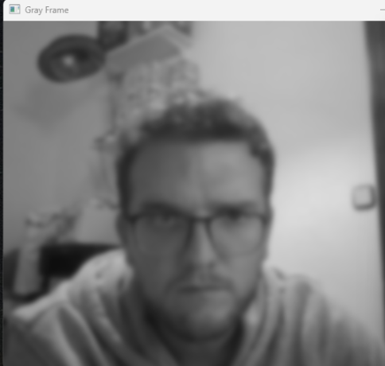
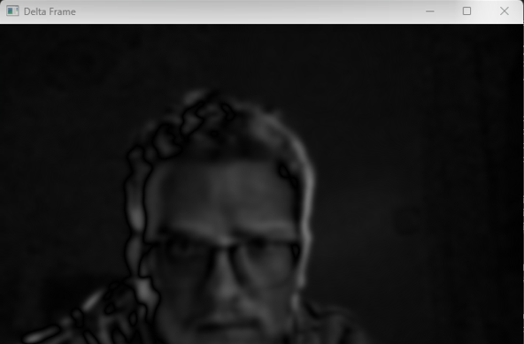
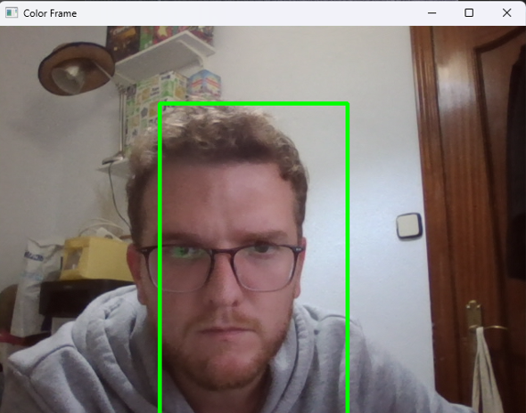

# Motion Detection and Tracking

This Python project uses OpenCV and Pandas to detect and track motion through the computer's webcam. When motion is detected, it records the start and end times, saving them in a CSV file. This project can be used for simple security purposes or to study patterns in motion detection.

## Features
- Detects motion through webcam input.
- Highlights moving objects in real-time using a green bounding box.
- Records the timestamp of motion start and end events.
- Saves motion event times to a CSV file (`Times.csv`) for later analysis.

## How It Works
1. **Initial Setup**: 
   - The program begins by capturing video from the default camera (`cv2.VideoCapture(0)`).
   - A grayscale and blurred version of the first frame is stored to establish a reference frame.

2. **Frame Processing**:
   - For each new frame, the difference from the reference frame is calculated to detect motion.
   - A binary threshold and dilation are applied to isolate regions of significant change.
   - Contours of these regions are detected, and if large enough, they are identified as motion.

3. **Motion Detection**:
   - Each frame is evaluated to check if motion (a contour above a specified area) is detected.
   - If motion is detected, a green rectangle is drawn around the moving area.
   - Status changes (motion started or ended) are recorded in `times`, with timestamps for each event.

4. **Data Storage**:
   - When the program is stopped (by pressing `q`), the recorded start and end times are saved in a CSV file, `Times.csv`, with columns for `Start` and `End` timestamps.

## Requirements
- Python 3.x
- OpenCV
- Pandas

## Screens
The program displays four real-time video frames:

- Gray Frame: Grayscale version of the current frame.
  
- Delta Frame: Difference between the first frame and current frame.
  
- Threshold Frame: Binary threshold of the delta frame.
  
- Color Frame: The original frame with detected motion highlighted.
  

